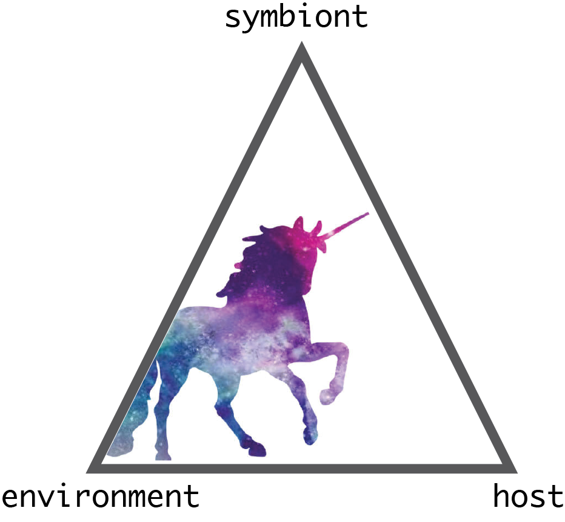

## Coming to Sunny California in 2021!
All life exchanges molecules with the environment. These molecules link organisms and impact the function, health, and sustainability of ecosystems. TI am interested in exploring how microorganisms use molecules to interact with their eukaryotic hosts and their environment. I employ a cross-disciplinary approach that combines [metabolomic](https://en.wikipedia.org/wiki/Metabolomics) and [meta'omic](https://en.wikipedia.org/wiki/Metagenomics) analyses with experimental manipulations to disentangle microbial interactions. My goal is to define how habitats and hosts shape the assemblage of complex microbiomes.

I will be starting my lab at UC Merced in January 2021. My research predominately focuses on exploring *host-microbe-environment* interactions with a focus on marine systems. 

  

